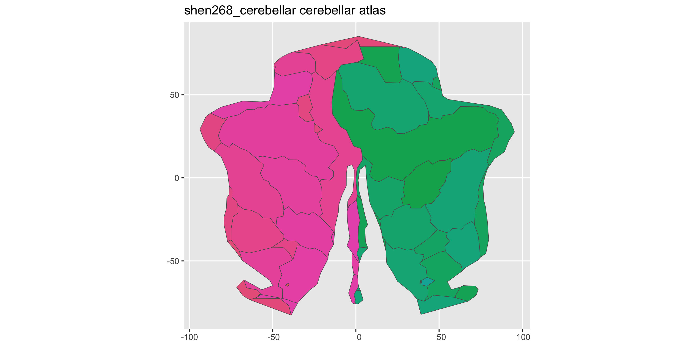

<!-- README.md is generated from README.qmd. Please edit that file -->

# ggsegShen

<!-- badges: start -->

[](https://github.com/ggsegverse/ggsegShen/actions/workflows/R-CMD-check.yaml)
[](https://ggseg.r-universe.dev/ggsegShen)
<!-- badges: end -->

Shen 268 functional parcellation atlas for the ggseg ecosystem.

Shen X, Tokoglu F, Papademetris X, & Constable RT (2013). Groupwise
whole-brain parcellation from resting-state fMRI data for network node
identification. *NeuroImage*, 82, 403-415.

## Installation

We recommend installing the ggseg-atlases through the ggseg
[r-universe](https://ggseg.r-universe.dev/ui#builds):

``` r
options(repos = c(
  ggseg = "https://ggseg.r-universe.dev",
  CRAN = "https://cloud.r-project.org"
))

install.packages("ggsegShen")
```

You can install this package from [GitHub](https://github.com/) with:

``` r
# install.packages("pak")
pak::pak("ggsegverse/ggsegShen")
```

## Cortical atlas

``` r
library(ggseg)
library(ggsegShen)

plot(shen268_cortical())
```


## Subcortical atlas

``` r
plot(shen268_subcortical())
```


Shen 268 is a *functional* parcellation derived from resting-state fMRI
connectivity, so the subcortical regions follow connectivity gradients
rather than named anatomical structures (thalamus, caudate, etc.) and
the left/right counts are not symmetric. Of the 268 parcels, 15 fall in
subcortical territory by a centroid criterion. The greyscale anatomy
behind the regions is FreeSurfer’s `cvs_avg35_inMNI152` aparc+aseg, used
as a visual backdrop only — Shen on its own provides only parcel IDs
without anatomical context. See `?shen268_subcortical` for details.

## Cerebellar atlas

``` r
plot(shen268_cerebellar())
```



## Data source

Shen X, Tokoglu F, Papademetris X, & Constable RT (2013). Groupwise
whole-brain parcellation from resting-state fMRI data for network node
identification. *NeuroImage*, 82, 403-415.
