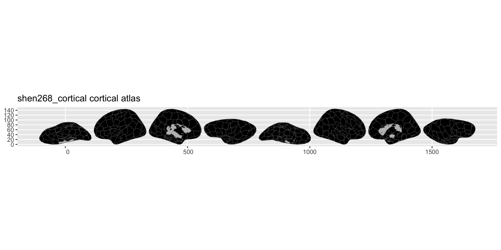
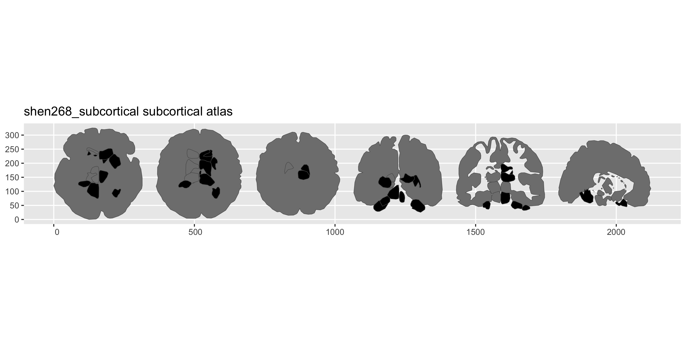

# ggsegShen

Shen 268 functional parcellation atlas for the ggseg ecosystem.

Shen X, Tokoglu F, Papademetris X, & Constable RT (2013). Groupwise
whole-brain parcellation from resting-state fMRI data for network node
identification. *NeuroImage*, 82, 403-415.

## Installation

We recommend installing the ggseg-atlases through the ggseg
[r-universe](https://ggseg.r-universe.dev/ui#builds):

``` r
options(repos = c(
  ggseg = "https://ggseg.r-universe.dev",
  CRAN = "https://cloud.r-project.org"
))

install.packages("ggsegShen")
```

You can install this package from [GitHub](https://github.com/) with:

``` r
# install.packages("pak")
pak::pak("ggsegverse/ggsegShen")
```

## Cortical atlas

``` r
library(ggseg)
library(ggsegShen)

plot(shen268_cortical())
```



## Subcortical atlas

``` r
plot(shen268_subcortical())
```



## Data source

Shen X, Tokoglu F, Papademetris X, & Constable RT (2013). Groupwise
whole-brain parcellation from resting-state fMRI data for network node
identification. *NeuroImage*, 82, 403-415.
